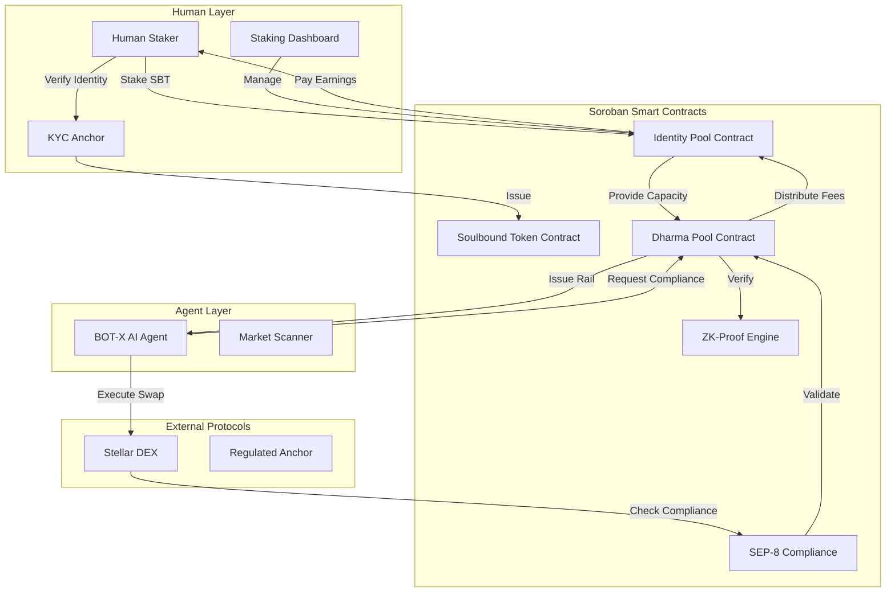

# Dharma Protocol v2.0 - Design Document

## Overview

Dharma Protocol v2.0 implements an "Identity as Liquidity" marketplace on Stellar/Soroban where verified humans stake their KYC credentials to provide compliance capacity that AI agents can rent for executing regulated transactions. The system uses zero-knowledge proofs to verify compliance without exposing personal information, creating a privacy-preserving bridge between human trust and autonomous agent execution.

### Core Value Proposition

- **For Human Stakers**: Earn passive income (APY) by staking verified identity with full control via spending limits and instant revocation
- **For AI Agents**: Execute regulated transactions autonomously without KYC friction or private key access
- **For Protocols**: Enable compliant agentic commerce without compromising user privacy

## Architecture

### High-Level System Architecture



### Technology Stack

- **Blockchain**: Stellar (Soroban smart contracts)
- **Smart Contract Language**: Rust (Soroban SDK)
- **Frontend**: Next.js 14 with TypeScript, React, Tailwind CSS
- **AI Agent Framework**: LangChain or Elara for autonomous decision-making
- **ZK-Proof Library**: Simplified ZK implementation using Soroban cryptographic primitives
- **Wallet Integration**: Freighter, Albedo for Stellar
- **Testing**: Stellar SDK testnet, Soroban CLI

## Components and Interfaces

### 1. Soulbound Token (SBT) Contract

**Purpose**: Non-transferable token representing verified KYC status

**State Variables**:
```rust
struct SBT {
    owner: Address,           // Stellar account address
    kyc_hash: BytesN<32>,     // Hash of KYC attestation
    issued_at: u64,           // Timestamp
    expires_at: u64,          // Expiration timestamp
    is_valid: bool,           // Active status
    anchor_id: Address,       // Issuing anchor
}
```

**Key Functions**:
- `issue_sbt(owner: Address, kyc_hash: BytesN<32>, duration: u64) -> Result<(), Error>`
- `verify_sbt(owner: Address) -> Result<bool, Error>`
- `revoke_sbt(owner: Address) -> Result<(), Error>`
- `is_valid(owner: Address) -> bool`

**Security Considerations**:
- Prevent transfer attempts with explicit checks
- Only authorized anchors can issue SBTs
- Implement time-based expiration
- Store only hash of KYC data, never raw PII

### 2. Identity Pool Contract

**Purpose**: Manages staking of SBTs and compliance capacity provisioning

**State Variables**:
```rust
struct Stake {
    staker: Address,
    sbt_id: BytesN<32>,
    spending_limit: i128,      // In stroops (1 XLM = 10^7 stroops)
    time_bound: u64,           // Unix timestamp
    staked_at: u64,
    accumulated_fees: i128,
    is_active: bool,
}

struct PoolState {
    total_capacity: i128,
    active_stakes: Map<Address, Stake>,
    total_fees_distributed: i128,
}
```

**Key Functions**:
- `stake_identity(sbt_id: BytesN<32>, spending_limit: i128, time_bound: u64) -> Result<(), Error>`
- `unstake_identity() -> Result<i128, Error>`  // Returns accumulated fees
- `update_limits(spending_limit: i128, time_bound: u64) -> Result<(), Error>`
- `get_available_capacity() -> i128`
- `calculate_apy() -> u32`  // Returns APY in basis points
- `claim_earnings() -> Result<i128, Error>`

**Business Logic**:
- Validate SBT before accepting stake
- Enforce minimum/maximum spending limits (100 - 10,000 USDC)
- Calculate proportional fee distribution based on stake size
- Implement time-weighted rewards for longer commitments

### 3. Dharma Pool Contract (Core Logic)

**Purpose**: Validates compliance queries and issues time-bound authorization rails

**State Variables**:
```rust
struct ComplianceRail {
    rail_id: BytesN<32>,
    agent: Address,
    spending_limit: i128,
    expires_at: u64,
    used_amount: i128,
    is_active: bool,
    backing_stakes: Vec<Address>,  // Stakers providing capacity
}

struct QueryFee {
    total_amount: i128,
    protocol_share: i128,    // 12%
    staker_share: i128,      // 88%
}
```

**Key Functions**:
- `request_compliance(agent: Address, amount: i128, duration: u64) -> Result<BytesN<32>, Error>`
- `validate_capacity(amount: i128) -> Result<bool, Error>`
- `issue_rail(agent: Address, proof: BytesN<64>) -> Result<ComplianceRail, Error>`
- `revoke_rail(rail_id: BytesN<32>) -> Result<(), Error>`
- `distribute_fees(rail_id: BytesN<32>) -> Result<(), Error>`
- `check_rail_validity(rail_id: BytesN<32>) -> bool`

**Fee Distribution Algorithm**:
```rust
fn distribute_fees(query_fee: i128, backing_stakes: Vec<Stake>) {
    let protocol_amount = query_fee * 12 / 100;
    let staker_amount = query_fee * 88 / 100;
    
    let total_capacity = backing_stakes.iter().sum(|s| s.spending_limit);
    
    for stake in backing_stakes {
        let share = (stake.spending_limit * staker_amount) / total_capacity;
        stake.accumulated_fees += share;
    }
}
```

### 4. ZK-Proof Engine

**Purpose**: Generate and verify zero-knowledge proofs for compliance without revealing PII

**Proof Structure**:
```rust
struct ComplianceProof {
    proof_data: BytesN<64>,      // ZK proof bytes
    public_inputs: Vec<i128>,    // Public parameters (amount, time)
    commitment: BytesN<32>,      // Commitment to private data
}
```

**Key Functions**:
- `generate_proof(stakes: Vec<Stake>, amount: i128) -> Result<ComplianceProof, Error>`
- `verify_proof(proof: ComplianceProof, amount: i128) -> Result<bool, Error>`
- `create_commitment(kyc_hash: BytesN<32>) -> BytesN<32>`

**ZK-Proof Logic** (Simplified for MVP):
1. Prove that sum of backing stakes >= requested amount
2. Prove that all backing SBTs are valid and non-expired
3. Prove that time bounds are satisfied
4. Do NOT reveal: individual staker identities, KYC data, exact stake amounts

**Implementation Note**: For MVP, use Soroban's cryptographic primitives (SHA-256, Ed25519) to create a simplified proof system. Full ZK-SNARKs can be added post-MVP.

### 5. SEP-8 Compliance Module

**Purpose**: Integrate with Stellar's regulated asset standard

**Key Functions**:
- `approve_transaction(tx_hash: BytesN<32>, rail_id: BytesN<32>) -> Result<bool, Error>`
- `check_compliance(sender: Address, receiver: Address, amount: i128) -> Result<bool, Error>`
- `register_anchor(anchor: Address) -> Result<(), Error>`

**SEP-8 Flow**:
1. Agent initiates transaction on DEX
2. Regulated asset anchor calls SEP-8 approval endpoint
3. Dharma Pool validates Compliance Rail
4. If valid, return approval; if invalid, reject transaction
5. Log decision on-chain for audit trail

### 6. AI Agent (BOT-X)

**Purpose**: Autonomous market scanner and transaction executor

**Architecture**:
```typescript
class BotX {
  private wallet: StellarWallet;
  private dharmaPool: DharmaPoolClient;
  private dexClient: StellarDEXClient;
  private marketScanner: MarketScanner;
  
  async scanMarket(): Promise<Opportunity[]>;
  async requestCompliance(amount: number, duration: number): Promise<ComplianceRail>;
  async executeSwap(opportunity: Opportunity, rail: ComplianceRail): Promise<TxResult>;
  async monitorRail(railId: string): Promise<void>;
}
```

**Decision Logic**:
1. Scan DEX for arbitrage or swap opportunities
2. Calculate required compliance capacity
3. Request Compliance Rail from Dharma Pool
4. Pay query fee (₹8 or equivalent in XLM/USDC)
5. Execute transaction using rail authorization
6. Monitor rail expiration and renew if needed

**Safety Mechanisms**:
- Never store or access human private keys
- Operate within spending limits at all times
- Gracefully handle rail revocation
- Implement circuit breakers for unexpected behavior

### 7. Frontend Dashboard

**Purpose**: User interface for human stakers to manage identity and earnings

**Pages**:

1. **Onboarding Page** (`/onboard`)
   - Connect Stellar wallet
   - Initiate KYC with anchor
   - Receive SBT confirmation

2. **Staking Page** (`/stake`)
   - View SBT status
   - Set spending limits (slider: 100-10,000 USDC)
   - Set time bounds (dropdown: 1h, 6h, 24h, 7d, 30d)
   - Display estimated APY
   - Stake/Unstake buttons

3. **Dashboard Page** (`/dashboard`)
   - Real-time earnings display
   - Active Compliance Rails list
   - Transaction history
   - Kill Switch button (prominent, red)
   - Analytics: total earned, number of queries served

4. **Settings Page** (`/settings`)
   - Update spending limits
   - Manage notifications
   - View audit logs

**Component Structure**:
```typescript
// Key React components
<WalletConnect />
<SBTStatus sbt={sbt} />
<StakingForm onStake={handleStake} />
<EarningsDisplay earnings={earnings} apy={apy} />
<ActiveRailsList rails={rails} onRevoke={handleRevoke} />
<KillSwitch onActivate={handleKillSwitch} />
```

**State Management**:
- Use React Context for wallet connection
- Use SWR or React Query for real-time data fetching
- WebSocket connection for live earnings updates

## Data Models

### Database Schema (Off-chain indexer for dashboard)

```typescript
// Staker Profile
interface StakerProfile {
  address: string;              // Stellar address
  sbtId: string;
  stakedAt: Date;
  spendingLimit: number;
  timeBound: Date;
  accumulatedFees: number;
  isActive: boolean;
}

// Compliance Rail
interface ComplianceRail {
  railId: string;
  agentAddress: string;
  spendingLimit: number;
  expiresAt: Date;
  usedAmount: number;
  isActive: boolean;
  backingStakers: string[];     // Array of staker addresses
  createdAt: Date;
}

// Transaction Log
interface TransactionLog {
  txHash: string;
  railId: string;
  agentAddress: string;
  amount: number;
  asset: string;
  timestamp: Date;
  status: 'pending' | 'success' | 'failed';
}

// Fee Distribution
interface FeeDistribution {
  railId: string;
  totalFee: number;
  protocolShare: number;
  stakerShares: Map<string, number>;  // address -> amount
  distributedAt: Date;
}
```

## Error Handling

### Smart Contract Errors

```rust
pub enum DharmaError {
    InvalidSBT,
    InsufficientCapacity,
    ExpiredRail,
    UnauthorizedAccess,
    InvalidProof,
    SpendingLimitExceeded,
    TimeBoundViolation,
    StakeNotFound,
    RailNotFound,
    TransferNotAllowed,      // For SBT transfer attempts
    AnchorNotRegistered,
}
```

### Error Recovery Strategies

1. **Insufficient Capacity**: Queue request or suggest increasing spending limit
2. **Expired Rail**: Auto-renew if agent has balance, otherwise notify
3. **Invalid Proof**: Regenerate proof with fresh data
4. **Spending Limit Exceeded**: Reject transaction, log attempt
5. **Kill Switch Activated**: Immediately void all rails, notify agent

### Frontend Error Handling

```typescript
try {
  await stakeIdentity(sbtId, limit, timeBound);
} catch (error) {
  if (error.code === 'INVALID_SBT') {
    showError('Your SBT has expired. Please renew KYC.');
  } else if (error.code === 'INSUFFICIENT_BALANCE') {
    showError('Insufficient XLM for transaction fee.');
  } else {
    showError('An unexpected error occurred. Please try again.');
    logError(error);  // Send to monitoring service
  }
}
```

## Testing Strategy

### Unit Tests

**Smart Contracts** (Rust):
- Test SBT issuance and revocation
- Test stake/unstake flows
- Test fee distribution calculations
- Test ZK-proof generation and verification
- Test spending limit enforcement
- Test time-bound expiration

**Frontend** (Jest/React Testing Library):
- Test wallet connection flow
- Test staking form validation
- Test Kill Switch activation
- Test earnings display updates
- Test error message rendering

### Integration Tests

**Contract Integration**:
- Test full flow: SBT issuance → Staking → Compliance request → Fee distribution
- Test SEP-8 approval flow with mock anchor
- Test Kill Switch propagation across contracts
- Test multi-staker capacity aggregation

**Agent Integration**:
- Test agent requesting compliance from Dharma Pool
- Test agent executing swap on mock DEX
- Test agent handling rail expiration
- Test agent response to Kill Switch

### End-to-End Tests

**Complete User Journey**:
1. User connects wallet and completes KYC
2. User receives SBT and stakes identity
3. Agent scans market and identifies opportunity
4. Agent requests and receives Compliance Rail
5. Agent executes swap on DEX
6. Fees are distributed to user
7. User views earnings in dashboard
8. User activates Kill Switch
9. Agent's rail is immediately revoked

**Performance Benchmarks**:
- SBT issuance: < 3 seconds
- Stake transaction: < 2 seconds
- ZK-proof generation: < 2 seconds
- Compliance Rail issuance: < 3 seconds
- Fee distribution: < 5 seconds
- Kill Switch activation: < 1 second

### Testing Tools

- **Soroban CLI**: Local contract testing and deployment
- **Stellar Testnet**: Integration testing with real network
- **Playwright**: E2E frontend testing
- **Postman/Thunder Client**: API endpoint testing
- **Hardhat/Foundry equivalent for Soroban**: Contract fuzzing

## Security Considerations

### Smart Contract Security

1. **Reentrancy Protection**: Use Soroban's built-in reentrancy guards
2. **Access Control**: Implement role-based permissions (admin, anchor, staker, agent)
3. **Integer Overflow**: Use checked arithmetic for all financial calculations
4. **Front-running Protection**: Use commit-reveal scheme for sensitive operations
5. **Upgrade Mechanism**: Implement proxy pattern for contract upgrades

### Privacy Protection

1. **Zero-Knowledge Proofs**: Never expose individual staker identities in proofs
2. **KYC Data**: Store only cryptographic hashes, never raw PII
3. **Transaction Privacy**: Use Stellar's memo field encryption for sensitive data
4. **Off-chain Indexer**: Ensure indexer doesn't log PII

### Agent Security

1. **Session Keys**: Agent uses ephemeral keys, never long-term wallet keys
2. **Spending Limits**: Hard-coded maximum limits in contract (cannot be bypassed)
3. **Rate Limiting**: Prevent agent from spamming compliance requests
4. **Audit Logging**: All agent actions logged on-chain

### Kill Switch Security

1. **Instant Propagation**: Revocation must propagate to all contracts within 1 second
2. **Irreversible**: Once activated, rail cannot be reactivated (must request new rail)
3. **No Partial Revocation**: Kill Switch revokes ALL active rails for that staker
4. **Emergency Admin Override**: Protocol admin can activate Kill Switch in case of compromise

## Performance Optimization

### On-Chain Optimization

1. **Batch Operations**: Group multiple fee distributions into single transaction
2. **State Minimization**: Store only essential data on-chain, use events for history
3. **Lazy Evaluation**: Calculate APY on-demand rather than storing
4. **Efficient Data Structures**: Use Soroban's optimized Map and Vec types

### Off-Chain Optimization

1. **Caching**: Cache SBT validity checks for 60 seconds
2. **Indexer**: Use Horizon or custom indexer for fast dashboard queries
3. **WebSocket**: Real-time updates without polling
4. **CDN**: Serve static assets from CDN for faster load times

## Deployment Strategy

### Phase 1: Testnet Deployment (Week 1-2)

1. Deploy SBT contract to Soroban testnet
2. Deploy Identity Pool contract
3. Deploy Dharma Pool contract
4. Deploy mock KYC anchor for testing
5. Deploy frontend to Vercel/Netlify

### Phase 2: Integration Testing (Week 3)

1. Deploy BOT-X agent to testnet
2. Integrate with Stellar testnet DEX
3. Run end-to-end test scenarios
4. Collect performance metrics
5. Fix bugs and optimize

### Phase 3: Demo Preparation (Week 4)

1. Record demo video of complete flow
2. Prepare pitch deck with live demo
3. Deploy to stable testnet environment
4. Create documentation and README
5. Prepare for hackathon presentation

### Mainnet Considerations (Post-MVP)

- Full security audit by third-party firm
- Gradual rollout with spending limit caps
- Bug bounty program
- Monitoring and alerting infrastructure
- Incident response plan

## Monitoring and Analytics

### On-Chain Metrics

- Total value staked (TVL)
- Number of active stakers
- Number of active Compliance Rails
- Total fees distributed
- Average APY
- Transaction success rate

### Agent Metrics

- Number of compliance requests
- Average rail duration
- Transaction volume
- Success/failure rate
- Average response time

### User Metrics

- User acquisition rate
- Average stake size
- Average earnings per staker
- Kill Switch activation rate
- User retention rate

### Monitoring Tools

- **Stellar Expert**: On-chain transaction monitoring
- **Grafana**: Custom dashboard for metrics
- **Sentry**: Error tracking and alerting
- **LogRocket**: Frontend session replay
- **PagerDuty**: Incident alerting

## Future Enhancements (Post-MVP)

1. **Multi-Chain Support**: Expand beyond Stellar to Ethereum, Solana
2. **Advanced ZK-Proofs**: Implement full ZK-SNARKs for stronger privacy
3. **Dynamic APY**: Adjust APY based on supply/demand
4. **Reputation System**: Reward long-term stakers with higher APY
5. **Agent Marketplace**: Allow multiple agents to compete for compliance
6. **Insurance Pool**: Protect stakers against agent misbehavior
7. **Governance Token**: Decentralize protocol decisions
8. **Mobile App**: Native iOS/Android apps for stakers
9. **Cross-Protocol Rails**: Single rail valid across multiple DEXs
10. **Institutional Staking**: Support for corporate KYC staking

## Conclusion

This design provides a comprehensive blueprint for building the Dharma Protocol v2.0 MVP within the 4-week timeline. The architecture prioritizes:

- **Privacy**: ZK-proofs ensure PII never leaves the staker
- **Control**: Kill Switch gives stakers instant revocation power
- **Simplicity**: Minimal viable features for hackathon demo
- **Scalability**: Architecture supports future enhancements
- **Compliance**: SEP-8 integration ensures regulatory adherence

The design balances technical sophistication with practical implementation constraints, focusing on delivering a working demo that showcases the "Identity as Liquidity" value proposition for the Agentic Commerce track.
